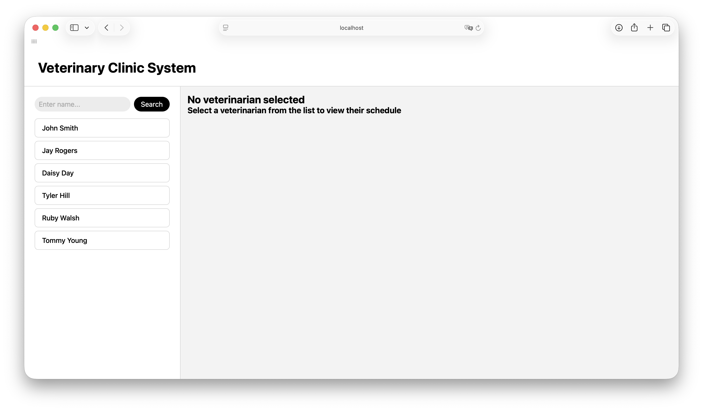
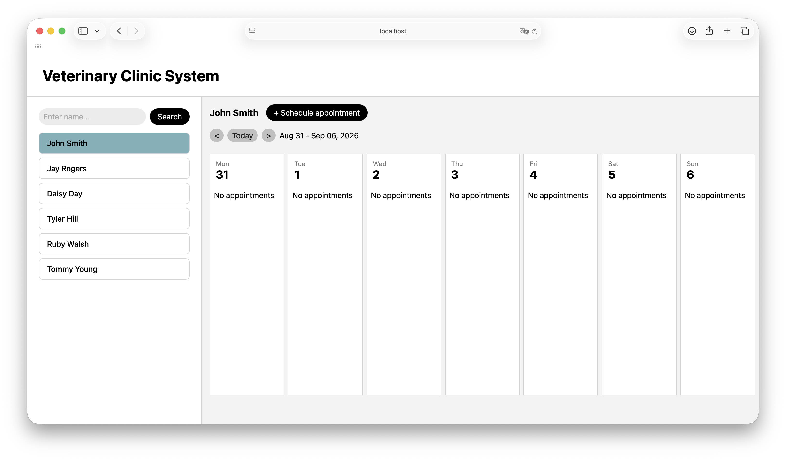
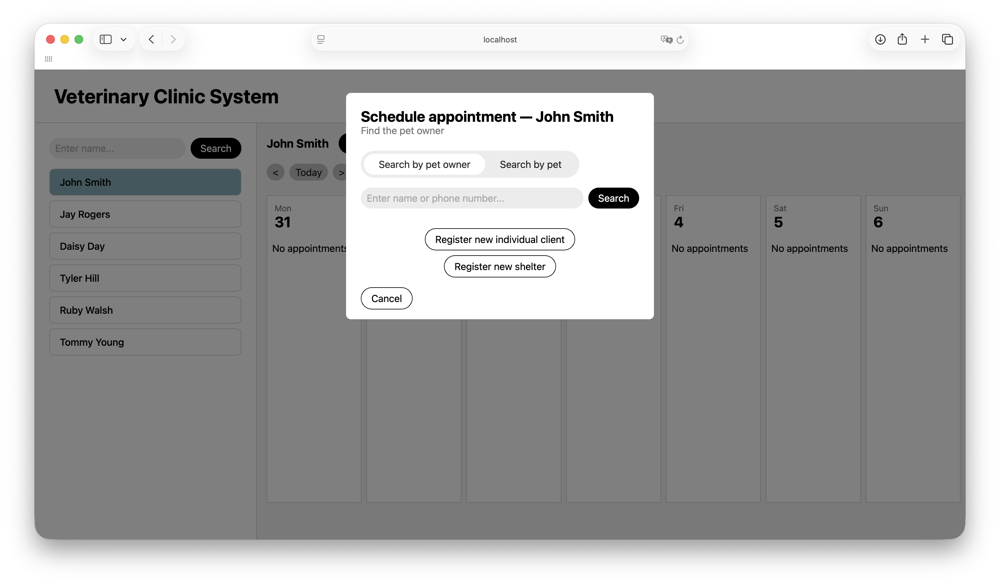
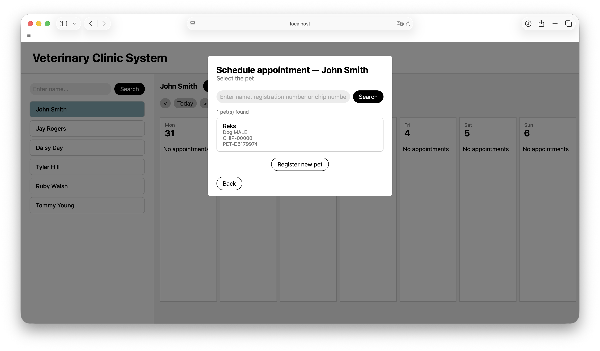
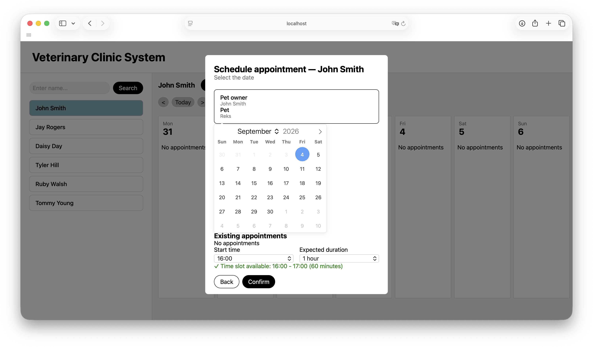
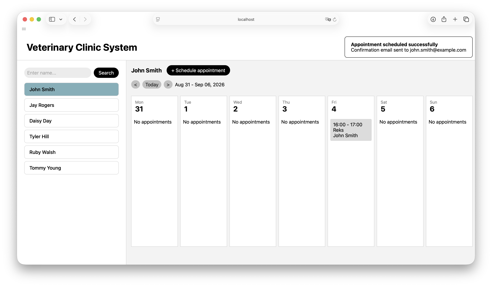
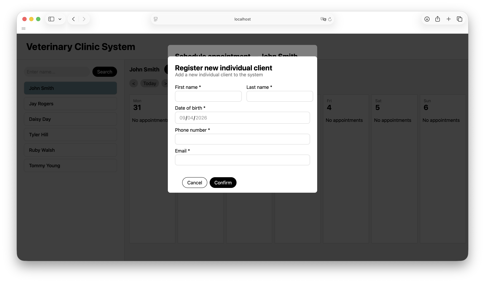
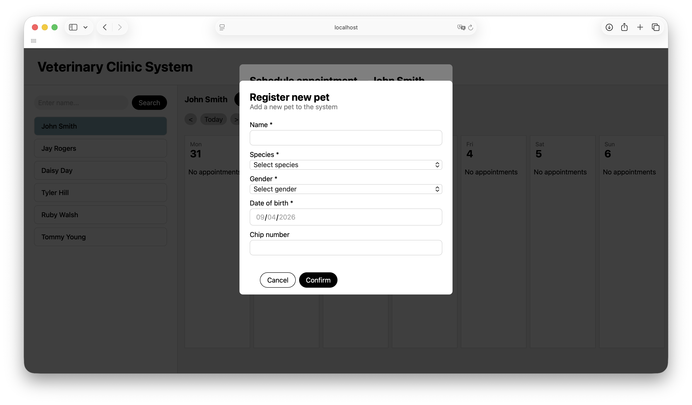

# Veterinary Clinic Management System
A web application for internal use by veterinary clinic staff — receptionists and veterinarians.

## Features
- Search and register pet owners (individuals and shelters) and their pets
- View veterinarian schedules and available appointment slots
- Book appointments with automatic email confirmation

## Tech Stack
- **Backend:** Java, Spring Boot, Spring MVC, Spring Data JPA, Spring Mail
- **Database:** H2 (file-based)
- **Frontend:**: Thymeleaf, htmx

## Setup
### 1. Clone the repository
```bash
git clone git@github.com:sariiev/vet-clinic-management-system.git
```

### 2. Fill in email credentials
```bash
cp application-secret.properties.example application-secret.properties
# Fill in MAIL_USERNAME and MAIL_PASSWORD
```

### 3. Run
```bash
./mvnw spring-boot:run
```

App runs at `http://localhost:8080/veterinarians`

## Screenshots
### Main page – veterinarian list


### Veterinarian schedule


### Client selection


### Pet selection


### Schedule appointment


### Appointment confirmed


### Client registration


### Pet registration


## Documentation
Full project documentation is available in [docs/MAS_13c_Sariiev_Artem_s30244.pdf](docs/MAS_13c_Sariiev_Artem_s30244.pdf):
- Functional & non-functional requirements
- Use case diagram & use case scenarios
- Activity diagrams
- State diagram (Appointment lifecycle)
- Analytical & design class diagrams
- GUI design mockups